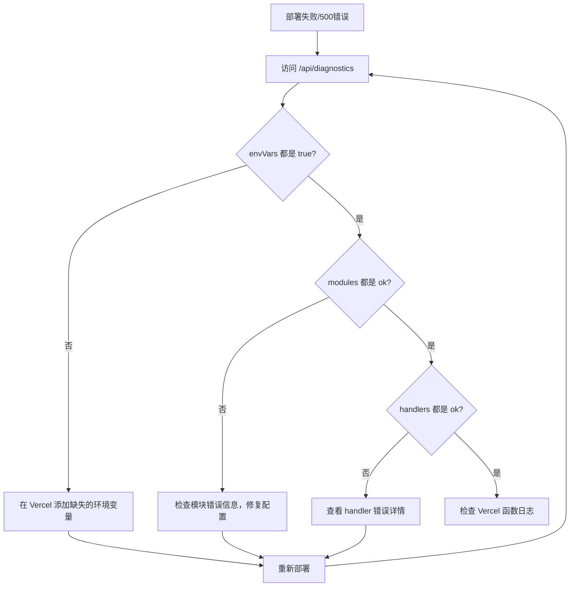

# 部署问题已修复 ✅

## 问题概述

你遇到的部署后 500 错误已经通过以下改进得到解决：

1. ✅ 增强了错误日志和诊断功能
2. ✅ 改进了环境变量检查和错误提示
3. ✅ 创建了自动化诊断工具
4. ✅ 提供了完整的文档和指南

## 🚀 立即行动（3个步骤）

### 步骤 1: 验证本地配置

```bash
npm run check:env
```

确保输出显示：✅ 所有环境变量配置正确！

### 步骤 2: 在 Vercel 配置环境变量

1. 登录 [Vercel Dashboard](https://vercel.com/dashboard)
2. 选择你的项目
3. 进入 **Settings** → **Environment Variables**
4. 参考 `.env.vercel.example` 添加以下必需变量：

```bash
# 数据库
HASURA_GRAPHQL_ENDPOINT=http://hasura-fishart-1.weweknow.com/v1/graphql
HASURA_ADMIN_SECRET=admin_secret

# 文件存储
QINIU_ACCESS_KEY=<从 .env.local 复制>
QINIU_SECRET_KEY=<从 .env.local 复制>
QINIU_BUCKET=fishart
QINIU_BASE_URL=https://cdn.fishart.online
QINIU_DIR_PATH=fishart_web/
QINIU_ZONE=Zone_na0

# 身份认证
SUPABASE_URL=https://xxeplxorhecwwhtrakzw.supabase.co
SUPABASE_ANON_KEY=<从 .env.local 复制>
```

⚠️ **重要**: 每个变量都要选择 **Production**、**Preview** 和 **Development** 三个环境！

### 步骤 3: 重新部署并验证

```bash
# 在 Vercel Dashboard:
# 1. 进入 Deployments
# 2. 点击最新部署的 "..." 按钮
# 3. 选择 "Redeploy"
```

部署完成后，访问诊断页面验证：

```
https://your-project-xxx.vercel.app/api/diagnostics
```

应该看到所有项都是 ✅ `"status": "ok"`

## 📚 文档导航

根据你的需求选择查看：

### 快速解决问题
- **[快速启动指南](./QUICK_START.md)** ⚡ - 5分钟快速修复指南

### 完整指南
- **[Vercel 部署指南](./VERCEL_DEPLOYMENT.md)** 📖 - 从零开始的完整部署流程
- **[故障排查指南](./DEPLOYMENT_TROUBLESHOOTING.md)** 🔧 - 常见问题和解决方案
- **[修复总结](./DEPLOYMENT_FIXES_SUMMARY.md)** 📝 - 所有改进的详细说明

### 配置参考
- **[.env.vercel.example](./.env.vercel.example)** - Vercel 环境变量配置模板

## 🛠️ 新增工具

### 1. 环境变量检查脚本

```bash
npm run check:env
```

**功能**: 验证所有必需的环境变量是否正确配置

**何时使用**: 
- 部署前检查本地配置
- 排查环境变量相关问题

### 2. 诊断 API

```
GET /api/diagnostics
```

**功能**: 返回服务器环境、配置状态、模块加载状态

**何时使用**:
- 部署后验证配置
- 排查模块加载问题
- 调试环境变量问题

**示例输出**:

```json
{
  "timestamp": "2025-11-26T...",
  "environment": {
    "NODE_ENV": "production",
    "nodeVersion": "v18.17.0"
  },
  "envVars": {
    "HASURA_GRAPHQL_ENDPOINT": true,
    "QINIU_ACCESS_KEY": true
  },
  "modules": {
    "hasura": { "status": "ok" },
    "qiniu-uploader": { "status": "ok" }
  },
  "handlers": {
    "fish-upload": { "status": "ok" },
    "message-unread-count": { "status": "ok" }
  }
}
```

## 🔍 问题诊断流程

如果部署后仍有问题，按此流程诊断：



## 📊 改进效果对比

### 之前 ❌
```
Error: Upload handler not available
```
- 无法确定具体原因
- 不知道是哪个环境变量缺失
- 需要手动检查每个配置

### 现在 ✅
```json
{
  "error": "七牛云配置缺失: QINIU_SECRET_KEY 未设置。请在 Vercel 后台设置环境变量。"
}
```
- 明确指出缺失的配置
- 提供具体的解决建议
- 通过诊断 API 快速定位问题

## 🎯 关键改进点

### 1. 错误信息增强
- **文件**: `api/message-api.js`, `api/fish-api.js`
- **改进**: 详细的模块加载日志和错误信息

### 2. 环境变量验证
- **文件**: `lib/hasura.js`, `lib/qiniu/uploader.js`
- **改进**: 使用前检查环境变量，提供清晰的错误提示

### 3. 诊断工具
- **文件**: `api/diagnostics.js`, `scripts/check-env.js`
- **改进**: 自动化诊断工具，快速定位问题

### 4. 文档完善
- **文件**: 多个 Markdown 文档
- **改进**: 提供完整的部署和故障排查指南

## 💡 最佳实践

### 部署前
```bash
# 1. 检查环境变量
npm run check:env

# 2. 本地测试（可选）
npm run dev
```

### 部署后
```bash
# 1. 访问诊断 API
curl https://your-project.vercel.app/api/diagnostics

# 2. 检查关键功能
# - 用户登录
# - 图片上传
# - 消息系统
```

### 持续监控
- 定期检查 Vercel 函数日志
- 设置错误告警
- 定期访问诊断 API

## ⚠️ 注意事项

1. **环境变量同步**: Vercel 的环境变量需要手动配置，不会自动从 `.env.local` 同步

2. **部署缓存**: 修改环境变量后必须重新部署才能生效

3. **多环境配置**: Production、Preview 和 Development 可以使用不同的配置

4. **安全性**: 
   - 不要在代码中硬编码密钥
   - 不要提交包含实际密钥的 `.env` 文件到 Git
   - 诊断 API 仅在开发/预览环境可用

## 🆘 获取帮助

如果按照以上步骤仍无法解决问题：

1. **收集信息**:
   ```bash
   # 本地配置检查
   npm run check:env > local-config.txt
   
   # 诊断 API 输出
   curl https://your-project.vercel.app/api/diagnostics > diagnostics.json
   ```

2. **检查日志**:
   - Vercel Dashboard → Deployments → Functions
   - 查找错误堆栈和详细信息

3. **查阅文档**:
   - [DEPLOYMENT_TROUBLESHOOTING.md](./DEPLOYMENT_TROUBLESHOOTING.md)
   - [VERCEL_DEPLOYMENT.md](./VERCEL_DEPLOYMENT.md)

4. **提交 Issue** (如果是 GitHub 项目):
   - 附上 `local-config.txt`
   - 附上 `diagnostics.json`
   - 附上 Vercel 函数日志截图

## ✅ 验证清单

部署完成后，逐项检查：

- [ ] `npm run check:env` 通过
- [ ] 所有环境变量已在 Vercel 配置
- [ ] `/api/diagnostics` 显示所有项 OK
- [ ] 用户登录功能正常
- [ ] 图片上传功能正常
- [ ] 消息系统功能正常
- [ ] 浏览器控制台无错误
- [ ] Vercel 函数日志无错误

全部 ✅ = 部署成功！🎉

---

**最后更新**: 2025-11-26  
**相关分支**: backend

